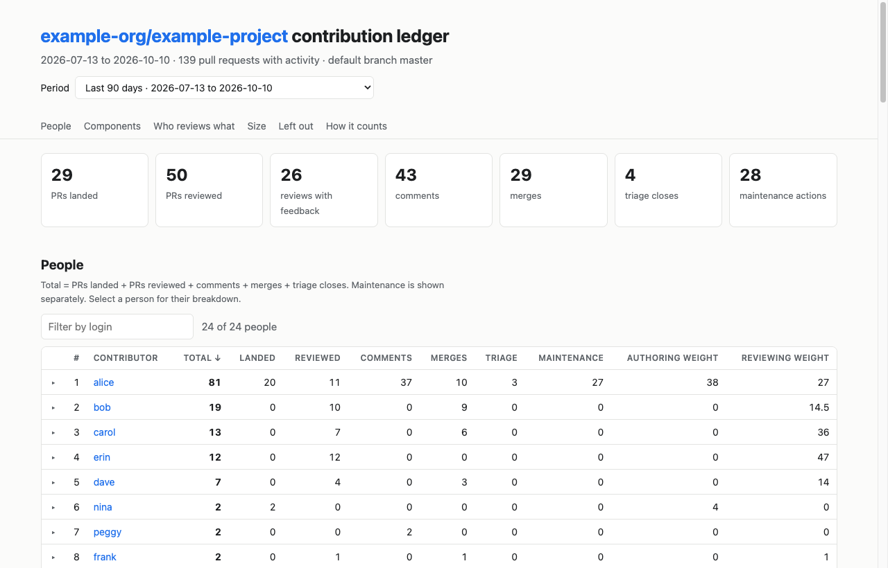
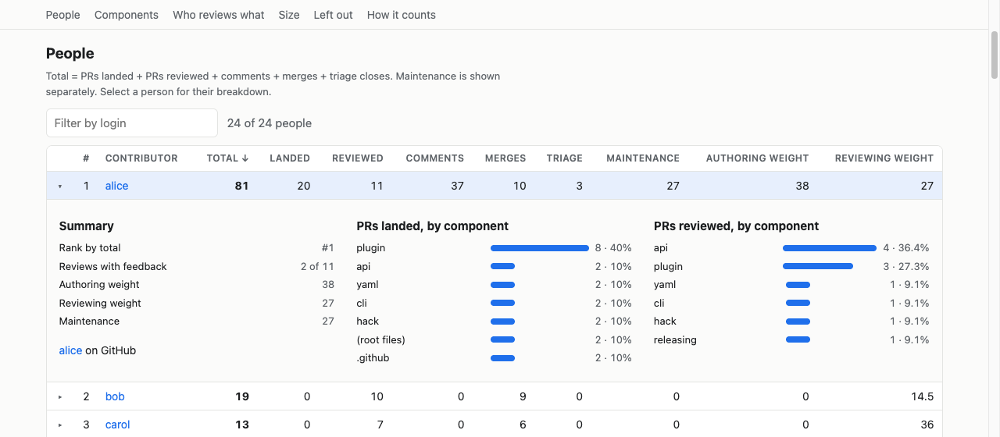
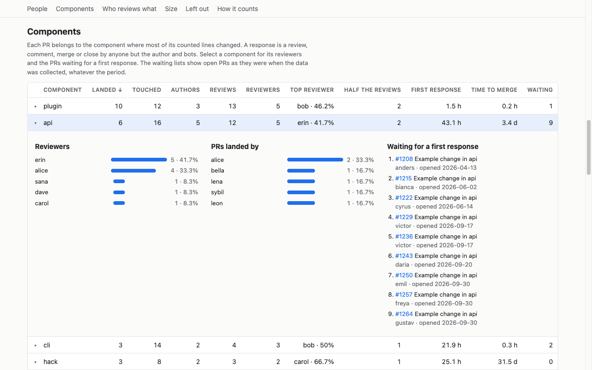
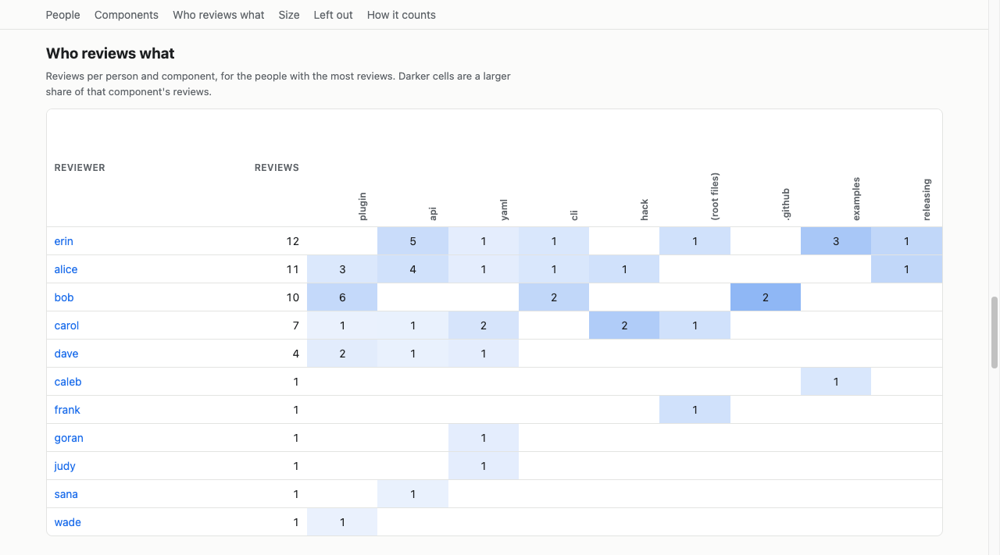
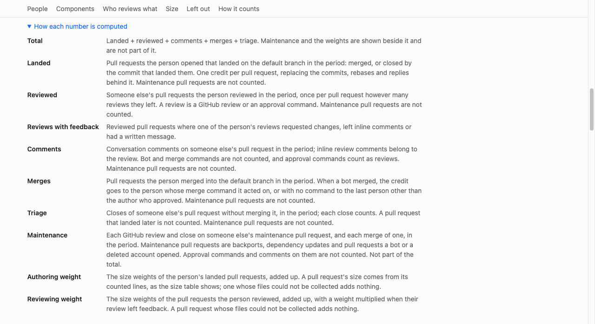
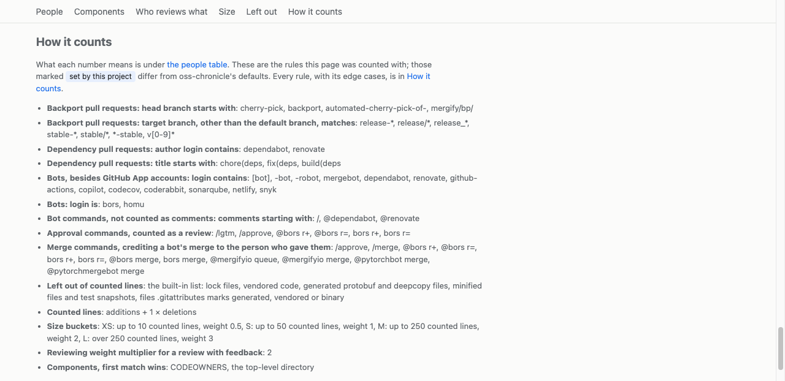

# oss-chronicle

Who actually built this release, counted fairly.

oss-chronicle counts the contributions behind an open source repository from GitHub pull request data. Activity trackers like LFX Insights count every GitHub event, so merge commits, rebases, authors replying on their own pull requests and the "closed" event GitHub fires on every merge all score as contributions. oss-chronicle counts finished work instead, and gives a reason for every event it leaves out.

<picture>
  <source media="(prefers-color-scheme: dark)" srcset="docs/images/page-overview-dark.png">
  
</picture>

> [!NOTE]
> Early development (v0.1 in progress). The Action collects, counts, weights by size, breaks the work down by component, and writes a run summary, JSON, CSV tables and a static web page.

## Quickstart

Add `.github/workflows/oss-chronicle.yml`:

```yaml
name: Contribution ledger
on:
  schedule:
    - cron: '17 4 * * *'   # daily
  workflow_dispatch:
permissions:
  contents: read
  pull-requests: read
concurrency:
  group: oss-chronicle
  cancel-in-progress: false
jobs:
  ledger:
    runs-on: ubuntu-latest
    steps:
      - uses: actions/checkout@v7          # only needed for .github/oss-chronicle.yaml
      - uses: ppapapetrou76/oss-chronicle@main
```

Then click **Run workflow** in the Actions tab. No config file is needed to start.

## What you get

- **A run summary** on the workflow run page: the people table, PR sizes, a breakdown per component, open PRs waiting for a first response, and what was left out and why.
- **An artifact** with the same data as JSON and CSV, and a self-contained web page you can open locally, publish on GitHub Pages, or add to your existing docs site. The page switches between the last 7, 30, 90, 180 and 365 days, last month, last quarter and last year, or [the periods and date ranges you choose](docs/configuration.md#periods).

Select a person for their work per component:



Select a component for its reviewers, its authors and the open PRs still waiting for a first response:



See who reviews which components, and where reviews depend on one person:



Open "How each number is computed" under the people table for what each column counts:



The page ends with the rules the run counted with. Rules the project's config changed are marked "set by this project":



The screenshots use real data with the repository name, logins, PR titles, PR numbers and two component names replaced by placeholders. The counts and dates are real.

The action only reads. It never writes to the repository, comments or opens issues.

> [!WARNING]
> On a public repository the run summary is public from the first run, and it ranks named contributors. Tell your contributors and decide how they can opt out before you add the workflow. See [Before you publish](docs/publishing.md#before-you-publish).

## Guide

- [Getting started](docs/getting-started.md): the first run, reading the results, troubleshooting.
- [Publishing the results](docs/publishing.md): GitHub Pages, or a page in your MkDocs, Docusaurus or other docs site.
- [Configuration](docs/configuration.md): inputs, outputs, the config file, components, opt-out.
- [How it counts](docs/how-it-counts.md): what earns credit, what is left out, and how each merge workflow is handled.

## Development

```bash
GITHUB_TOKEN=$(gh auth token) GITHUB_REPOSITORY=owner/name go run ./cmd/oss-chronicle run
go test ./...
```

The tests build their pull requests in code, so they need no network access and no recorded data.
